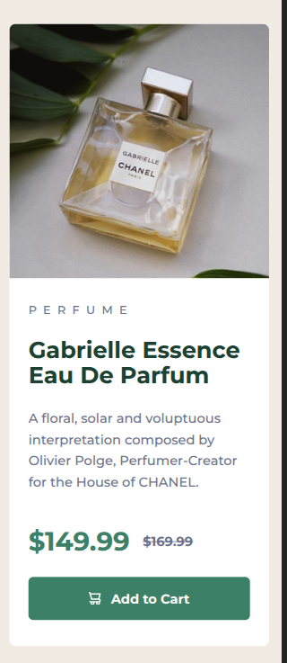

# Frontend Mentor - Social links profile solution

This is a solution to the [Social links profile challenge on Frontend Mentor](https://www.frontendmentor.io/challenges/social-links-profile-UG32l9m6dQ). Frontend Mentor challenges help you improve your coding skills by building realistic projects.

## Table of contents

- [Overview](#overview)
  - [The challenge](#the-challenge)
  - [Screenshot](#screenshot)
  - [Links](#links)
- [My process](#my-process)
  - [Built with](#built-with)
- [Author](#author)

## Overview

### The challenge

Your challenge is to build out this recipe page and get it looking as close to the design as possible.

You can use any tools you like to help you complete the challenge. So if you've got something you'd like to practice, feel free to give it a go.

### Screenshot

### Links

- Solution URL: [Solution URL](https://github.com/Sandy-SandBox/product-preview-card-component-main)
- Live Site URL: [Live site URL](https://sandy-sandbox.github.io/product-preview-card-component-main/)

### Built with

- Semantic HTML5 markup
- CSS custom properties
- CSS Grid

## Author

- Website - [Sushant](https://sushantz.netlify.app/)
- Frontend Mentor - [@Sandy-SandBox](https://www.frontendmentor.io/profile/Sandy-SandBox)
